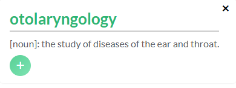

# Chrome Extension Dictionary

## Select the text while reading

- When you select the text, the extension will extract the text.
- It will show you the exact definition based on the context of the sentence around.
- Click the + button to show the explanation of the context!
    
  
    

  Gemini API used: ( gemini-1.5-flash )

## Proxy Server

Handles API requests for the extension, keeping API keys out of the client-side code.

1. Keeping API keys on the server side only.
2. Preventing API key exposure in the distributed extension.

### API Endpoints

- `GET /health` - Check if the server is up and running.
- `POST /api/analyze` - Text Analysis Endpoint
- `POST /api/definition` - Text Definition Endpoint

### Considerations

- Use HTTPS in PROXY_SERVER_URL (background.js)
